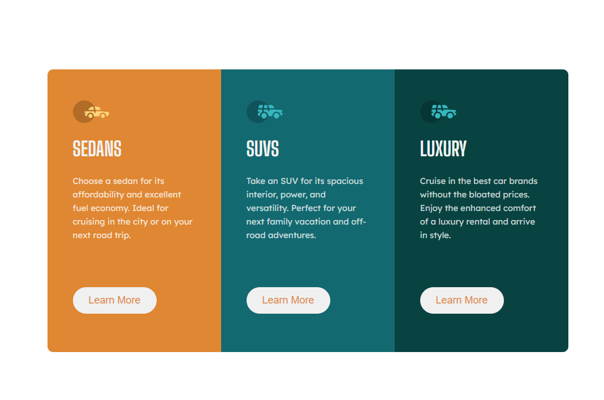
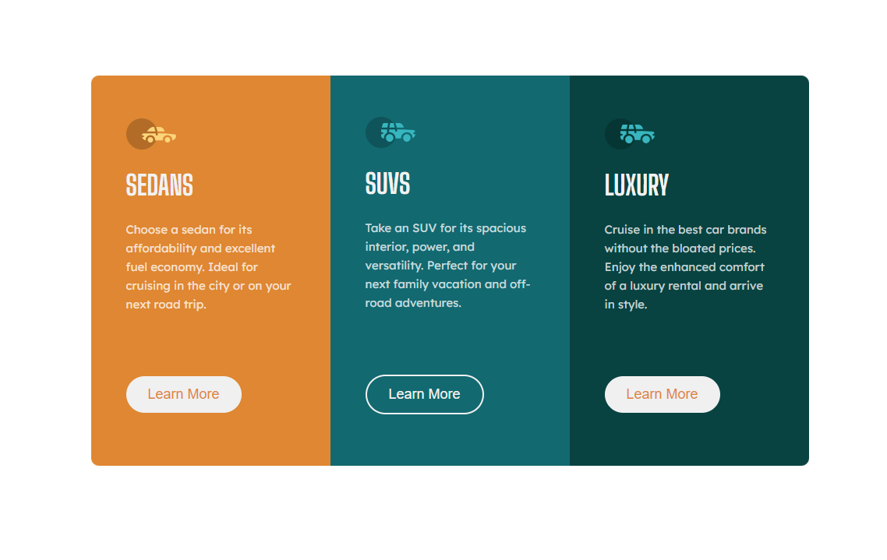
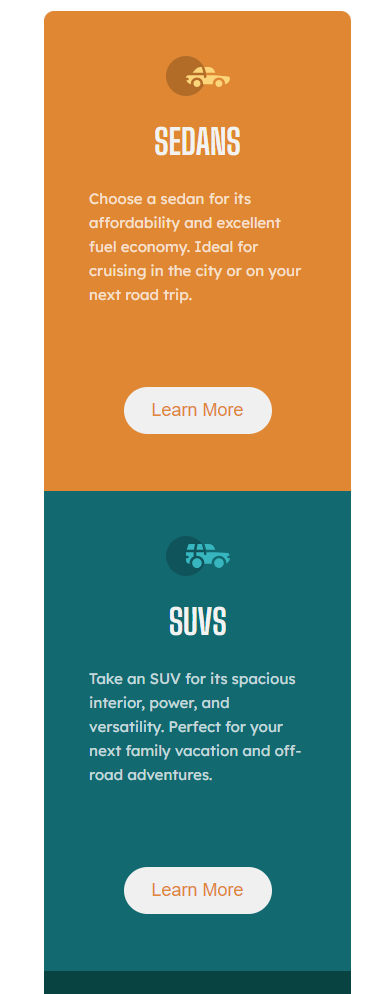

# Frontend Mentor - 3column-preview-card-component solution

This is a solution to the [Results summary component challenge on Frontend Mentor](https://www.frontendmentor.io/challenges/results-summary-component-CE_K6s0maV). Frontend Mentor challenges help you improve your coding skills by building realistic projects. 

## Table of contents

- [Overview](#overview)
  - [The challenge](#the-challenge)
  - [Screenshot](#screenshot)
  - [Links](#links)
- [My process](#my-process)
  - [Built with](#built-with)
  - [What I learned](#what-i-learned)
- [Author](#author)


## Overview

### The challenge

Users should be able to:

- View the optimal layout for the interface depending on their device's screen size
- See hover and focus states for all interactive elements on the page
- **Bonus**: Use the local JSON data to dynamically populate the content

### Screenshot







### Links

- Solution URL: [github](https://github.com/win5ton0c/frontendmentor/tree/main/Frontend/3-column-preview-card-challenge)
- Live Site URL: [live site](https://win-3-card-comp.netlify.app/)

## My process

deal with the layout first and style it 

### Built with

- Semantic HTML5 markup
- CSS custom properties
- Flexbox
- CSS Grid


### What I learned

Using shorthand properties
-font shorthand for setting font-style, font-variant, font-weight, font-size, line-height, and font-family

 ```
font: 700 35px "Big Shoulders Display", sans-serif;
```


## Author

- Frontend Mentor - [@win5ton0c](https://www.frontendmentor.io/profile/win5ton0c)
- Twitter - [@W1n5ton](https://www.twitter.com/@W1n5ton)


