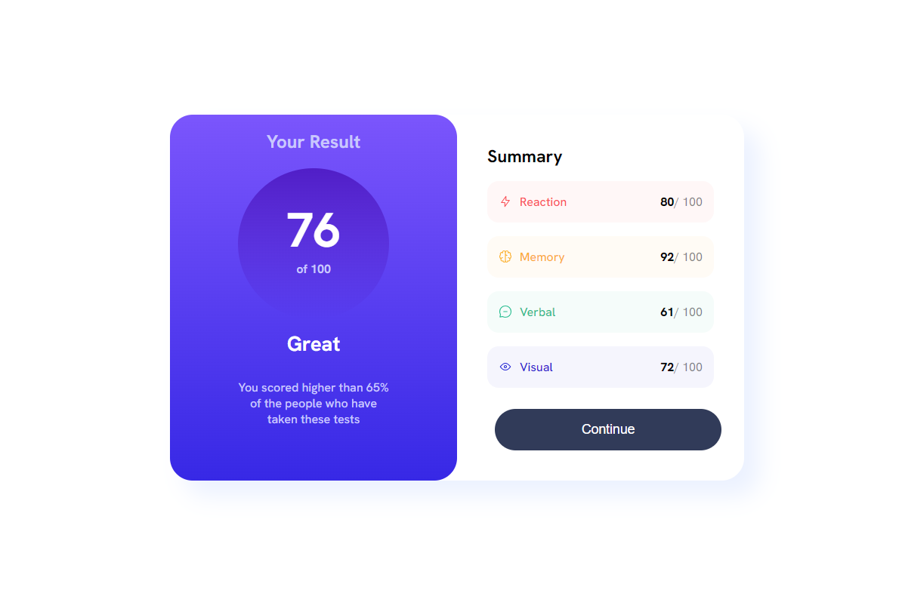
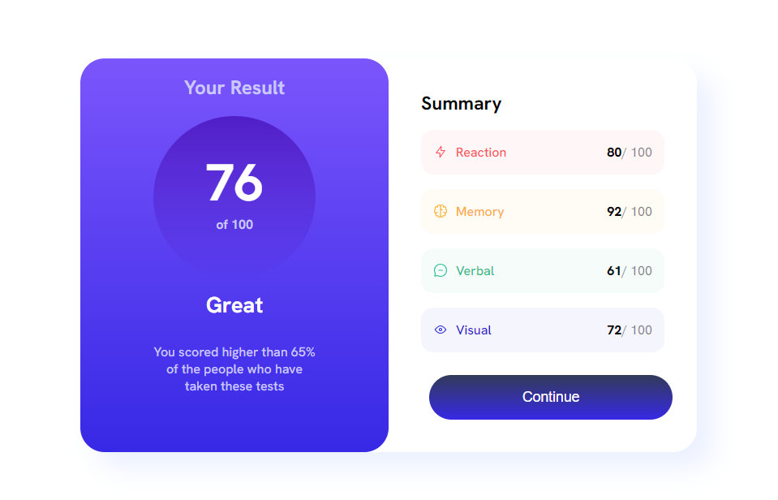
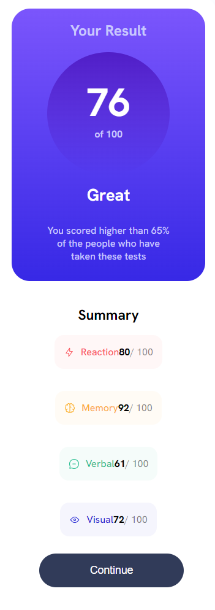

# Frontend Mentor - Results summary component solution

This is a solution to the [Results summary component challenge on Frontend Mentor](https://www.frontendmentor.io/challenges/results-summary-component-CE_K6s0maV). Frontend Mentor challenges help you improve your coding skills by building realistic projects. 

## Table of contents

- [Overview](#overview)
  - [The challenge](#the-challenge)
  - [Screenshot](#screenshot)
  - [Links](#links)
- [My process](#my-process)
  - [Built with](#built-with)
  - [What I learned](#what-i-learned)
  - [Continued development](#continued-development)
  - [Useful resources](#useful-resources)
- [Author](#author)
- [Acknowledgments](#acknowledgments)


## Overview

### The challenge

Users should be able to:

- View the optimal layout for the interface depending on their device's screen size
- See hover and focus states for all interactive elements on the page
- **Bonus**: Use the local JSON data to dynamically populate the content

### Screenshot







### Links

- Solution URL: [github](https://github.com/win5ton0c/frontendmentor/tree/main/Frontend/results-summary-challenge)
- Live Site URL: [live site](https://win-result-comp.netlify.app/)

## My process

### Built with

- Semantic HTML5 markup
- CSS custom properties
- Flexbox
- CSS Grid


### What I learned

That its actually easy messing with the opcaity of colors by changing the hsl alpha value

 ```
background: linear-gradient(to right, hsla(0, 100%, 50%, 0.1), hsla(120, 100%, 50%, 0.1));
```


### Continued development

i might come back to this challenge to add some functionality i have some ideas in mind


### Useful resources

- [mdn docs](https://developer.mozilla.org/en-US/docs/Learn/CSS/CSS_layout/Flexbox) - 


## Author

- Frontend Mentor - [@win5ton0c](https://www.frontendmentor.io/profile/win5ton0c)
- Twitter - [@W1n5ton](https://www.twitter.com/@W1n5ton)


